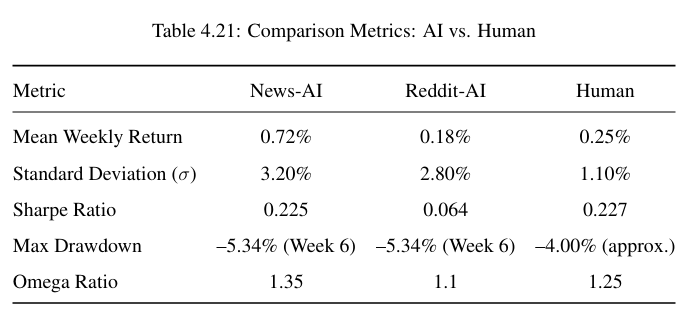
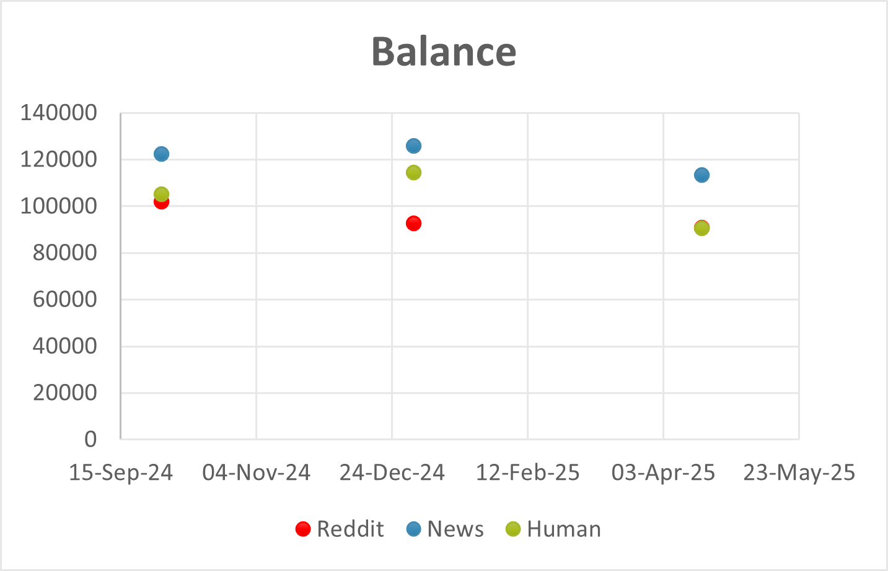
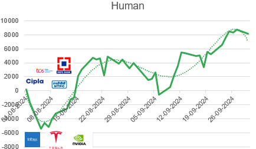
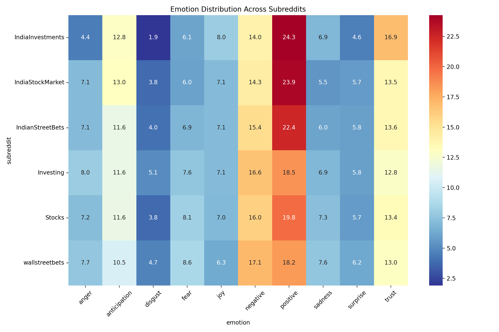

# Human vs AI: Analytics and Experiments

This repository explores the differences between human decision-making and AI-driven approaches in various data-focused tasks. It includes real-world projects, analytics, and models designed to test, compare, and evaluate how each performs under different scenarios.

The primary goal is to understand where AI shines, where human intuition still matters, and how both can be used effectively depending on the context.

---

## Overview

This project includes a range of experiments, with a strong focus on areas like:

- Stock market forecasting and trading strategies
- Sentiment analysis from social media and financial news
- Real-time data analytics
- Model interpretability and result validation

Each project compares AI-generated results with human logic or decision paths. Some are designed to run live, while others use historical data for backtesting and benchmarking.

---
## Findings and Results

  

  

  

  

  

  

  

  

  

  

** This is a real time intraday trading model-it selected stocks only based on the sentiments of the headlines from  AUG 1 2024 - SEPT 31 2024 (8 week comparison). 

## if you want i can share all the analysis which i used for my dissertation.(more indepth analysis and explaination).

## What's Included

- Code for both AI and human-based strategies
- Pre-built models (LSTM, PPO, FinBERT, etc.)
- Data collection tools (Reddit, Twitter, SEC filings, financial APIs)
- Analytics scripts and visualizations
- Evaluation metrics (accuracy, profit, drawdown, Sharpe ratio)

---

## THIS IS FOR THOSE

This repository is ideal for:

- Researchers exploring AI in practical decision-making
- Students working on data science or AI projects
- Traders and analysts curious about automation and prediction
- Anyone interested in the overlap of human logic and machine learning

---

## How to Use

1. Clone the repository
2. Follow setup instructions in each project folder
3. Run the experiments and compare results
4. Contribute your own data or logic if you'd like to expand the comparisons

---

## License

This project is open source and free to use for non-commercial purposes. Contributions are welcome.

---

Feel free to explore, run the code, and draw your own conclusions on how AI and human intelligence perform under different conditions.

